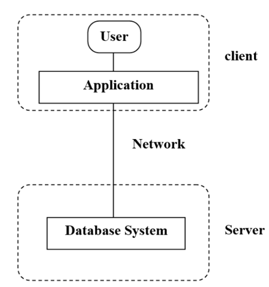
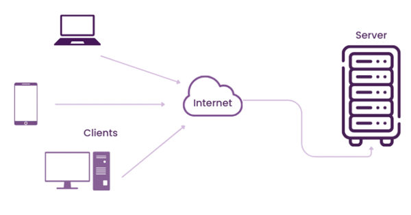
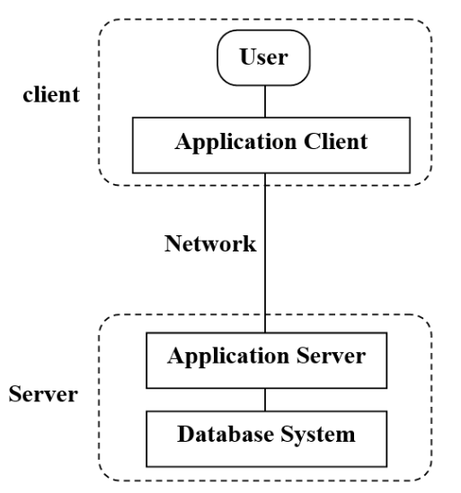
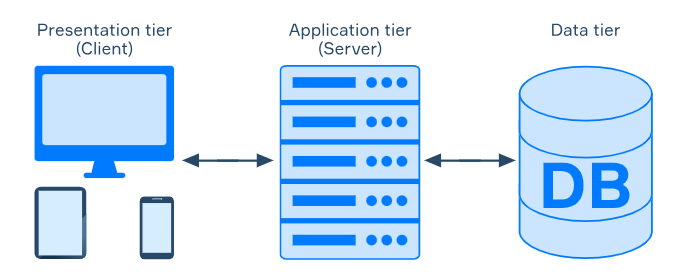

### Introduction
Client-server architecture is a computing model in which the server hosts, delivers and manages most ofthe resources and services to be consumed by the client. This type of architecture has one or more client computers connected to a central server over a network or internet connection. Client-server architecture is also known as a networking computing
model or client-server network because all the requests and services are delivered over a network.

**Examples of the Client-Server architecture:**

1- **Mail servers –** These allow sending and receiving emails between different parties. Email handling can be done by different software.

2- **File servers –** They offer a central location where files can be stored. Google Docs is a good example of where you can easily save a file from your PC and access or edit it using your phone. They also facilitate access to multiple users.

3- **Web servers –** They are supercomputers with high-performance capabilities that are good for hosting various web pages. The client uses high-speed internet to request server-side data.

<h3> Two-Tier Client-Server Architecture </h3>

In a two-tier client-server architecture, the client directly communicates with the server. This architecture is simple and effective for small-scale applications but may face scalability issues as the number of clients increases.

<figcaption>(A) Two-Tier Client-Server Architecture</figcaption>

### Components of Two-Tier Client-Server Architecture:-

- **Client:** The client is a device or software that initiates requests for services or resources from the server. It acts as the front-end interface for the user.
 Clients initiate communication sessions with servewrs to request data or services. For example, when you open a website in your browser, your computer acts as the client.
Clients generatlly have a user interface that users interact with.

- **Server:** The server is a powerful computer or software that provides services or resources to clients. It processes the client requests and sends back the required information.
Servers wait for requests from clients and then respond to them. for example, a web server hosts and serves web pages to browsers that request them.
Servers can handle multiple client requests simultaneously, often through various protocols such as HTP, FTP, and SMTP.

- **Internet:** The network connects clients and servers, allowing data exchange. It can be a local area network (LAN), wide area network (WAN), or the internet.
The data transfer between the client and the server occurs over the internet, passing through various networking components like routers, switches, and gateways.
Data is often transferred in small packets, which are reassembled at the destination(client or server).

### Characteristics of Two-Tier Client-Server Architecture:-

- **Simplicity:** Two-tier architecture involves a straightforward setup with only two layers: the client and the server.
 Easier to design, implement, and maintain due to its simplicity in structure.
 Fewer components reduce complexity in development and troubleshooting.

- **Direct Communication:** Clients communicate directly with the server to request and receive data.
 Generally lower latency as there is no intermediary layer between the client and server.
 Direct communication can lead to faster response times for requests and data retrieval.

- **Limited Scalability:** As the number of clients increases, the server may become a bottleneck due to handling all requests and processing tasks.
 Scaling requires upgrading the server to handle increased load, which can be expensive and challenging.
 Performance may degrade with high numbers of simultaneous client requests, as the server has to manage both application logic and data storage.
- **Tight Coupling:** The client and server are tightly coupled, meaning changes in one layer can directly impact the other.
 Limited flexibility in terms of updating or modifying components independently, as changes to the server may require corresponding changes to the client.
 Maintenance and upgrades can be more complex due to the interdependency between client and server components.

### Use Cases of Two-Tier Client-Server Architecture:-

- **Small-scale applications:** Ideal for applications with a limited user base and low complexity 

   **Examples:**
    Desktop applications for individual use
    Lightweight internal tools for small teams

   **Advantages:** Easy to implement and manage; sufficient for applications with minimal performance demands.
   - Simple database applications
   - Personal or small business environments

- **Simple Database Applications:** Suitable for applications where the client directly interacts with a database server for data retrieval and updates.

   **Examples:**
   Small inventory management systems
   Basic customer relationship management (CRM) tools.

   **Advantages:** Direct client-to-database communication simplifies architecture and reduces overhead.

- **Personal or Small Business Environments:** Effective for environments where a small number of users access shared resources or services.
    
   **Examples:**
     Personal finance software
     Small business accounting systems.
    
   **Advantages:** Cost-effective and straightforward solution for businesses or individuals with modest IT needs.

 

<figcaption>(B) Visual Representation of Two-Tier Client-Server Architecture</figcaption>

### Advantages of Two-Tier Client-Server Architecture:-
- **(a) Cost-Effective:** Generally, it requires less hardware and infrastructure compared to more complex architectures, making it a cost-effective solution for smaller applications.
- **(b) Resource Allocation:** In a two-tier setup, resources are focused on just two tiers, which can make it easier to allocate and manage server resources effectively.
- **(c) Reduced Server Load:** Since the client handles some of the processing, the server’s load can be reduced, potentially leading to better performance for specific tasks.
- **(d) Direct Communication:** The direct interaction between the client and server can result in faster data retrieval and less data processing overhead compared to multi-tier systems.
 

### Disadvantages of Two-Tier Client-Server Architecture:-
- **(a) Limited Reusability:** With application logic embedded in client applications, reusing that logic across different clients or systems can be difficult, leading to potential code duplication and reduced efficiency.
- **(b) Lack of Intermediate Layer:** The absence of an intermediate layer (like in a three-tier architecture) means that certain functionalities such as load balancing, caching, or transaction management are not inherently supported, which can impact performance and reliability.
- **(c) Data Integrity and Security:** With clients having direct access to the database, there can be security and data integrity concerns. Ensuring proper access controls and data validation on the client side can be challenging.
- **(d) Scalability Issues:** In a two-tier architecture, the client and server are directly connected. As the number of clients grows, the server can become a bottleneck, leading to performance issues and difficulties in scaling.

  

<h3> Three-Tier Client-Server Architecture </h3>

Three-tier client-server architecture is a software architecture model that divides applications into three distinct layers: the presentation layer, the application logic layer, and the data storage layer. This separation of concerns enhances the organization, scalability, and maintainability of applications.

<figcaption> (C) Three-Tier Client-Server Architecture</figcaption>

### Components of Three-Tier Client-Server Architecture:-
1. **Presentation Tier**: It is the user interface and topmost tier in the architecture. Its purpose is to take request from the client and displays information to the client. It communicates with other tiers using a web browser as it gives output on the browser. If we talk about Web-based tiers then these are developed using languages like- HTML, CSS, JavaScript.

2. **Application Tier**: It is the middle tier of the architecture also known as the logic tier as the information/request gathered through the presentation tier is processed in detail here. It also interacts with the server that stores the data. It processes the client’s request, formats, it and sends it back to the client. It is developed using languages like- Python, Java, PHP, etc.

3. **Database Tier**: It is the last tier of the architecture also known as the Database Tier. It is used to store the processed information so that it can be retrieved later on when required. It consists of Database Servers like- Oracle, MySQL, DB2, etc. The communication between the Presentation Tier and Data-Tier is done using middle-tier i.e. Application Tier.

### Characteristics of Three-Tier Client-Server Architecture:-

- **Modularity:** By separating the application into three distinct layers (presentation, application logic, and data), you make it easier to manage and develop each component independently. This separation helps in organizing code and functionality better.

- **Scalability:** With the middle layer (application logic) handling requests and the data layer managing database interactions, the system can efficiently scale to support more users or increased data volume. Load balancing can be implemented to distribute client requests across multiple servers.

- **Maintainability:** Each layer can be updated or maintained separately without impacting the others. For instance, you can upgrade the database or modify business logic without having to change the presentation layer, making it easier to manage and implement changes.

- **Flexibility:** The separation of concerns allows for diverse technologies and platforms to be used in different layers. This means you can integrate new technologies or change components (e.g., swapping out the database or updating the user interface) with minimal disruption

### Use Cases of Three-Tier Client-Server Architecture:-

- **Large-scale enterprise applications:**  These often require a robust architecture that can handle complex business logic and a high volume of transactions. Three-tier architecture helps manage this complexity by separating concerns into different layers, which supports scalability and maintainability.

    **Examples:**
      ERP Systems (Enterprise Resource Planning), such as SAP or Oracle ERP.
    
   **Advantages:**  Handles high volumes of transactions and users efficiently.
    Allows separate management of user interfaces, business logic, and databases, making updates and maintenance easier.
    Supports complex business processes and integration with other systems.
    Facilitates adding or modifying features without affecting the entire system.

- **Web applications:** Three-tier architecture is particularly suited for web applications where the presentation layer (user interface) interacts with the application layer (business logic) and the data layer (database). This separation helps in developing, deploying, and managing web apps more effectively.

   **Examples:**
      E-commerce Platforms, like Amazon or eBay.
    
   **Advantages:**  Can manage large amounts of user traffic and transactions by distributing load across servers.
    Allows for independent updates to the front-end, back-end, and database components.
    Easily integrates with various third-party services and technologies (e.g., payment gateways, shipping services).
    Supports diverse functionalities such as user accounts, product catalogs, and order processing through separate layers.

- **Distributed systems:** In distributed systems, where components may be spread across multiple servers or locations, three-tier architecture provides a clear structure for managing communication and data flow between different components. It also facilitates scaling and integrating various parts of the system.

   **Examples:**
      Cloud-Based File Storage Services, such as Google Drive or Dropbox.
    
   **Advantages:**  Manages a vast amount of data and numerous simultaneous users by distributing tasks across multiple servers.
    Simplifies updates and maintenance by allowing changes in one layer (e.g., user interface) without impacting others (e.g., data storage).
    Integrates with various services and platforms, offering diverse functionalities (e.g., file sharing, collaboration tools).
    Supports complex operations like file synchronization and user access management through separate components.

<figcaption> (D) Architectural Diagram of Three-Tier Client-Server Architecture</figcaption>

 ### Advantages of Three-Tier Client-Server Architecture:-
- **(a) Scalability:**  Each tier can be scaled independently. For instance, you can scale the database server separately from the application server or presentation server, depending on the system's needs.

- **(b) Improved Security:** By isolating the data layer, sensitive data can be better protected. The application and presentation layers handle user interactions, while the data layer manages database access and security.

- **(c) Enhanced Performance:** Load balancing can be applied to the application and presentation layers, reducing the load on any single server and improving overall performance.

- **(d) Reusability:** Business logic in the application layer can be reused by multiple presentation layers (e.g., web and mobile apps), promoting consistency and reducing duplication of effort.

### Disadvantages of Three-Tier Client-Server Architecture:-
- **(a) Increased Cost:** The need for additional hardware, software licenses, and maintenance for the different tiers can lead to higher overall costs for implementation and operation.

- **(b) Complex Deployment:** Deploying and managing a three-tier application can be more complex compared to a simpler two-tier system, as it involves configuring and maintaining multiple servers and services.

- **(c) Increased Complexity:** The three-tier architecture introduces additional layers (presentation, application, and database) compared to two-tier architectures. This complexity can make the system more challenging to design, implement, and maintain.

- **(d) Dependency on Network:** Since the architecture relies on network communication between the tiers, network issues or downtime can impact the entire system's availability and performance.

